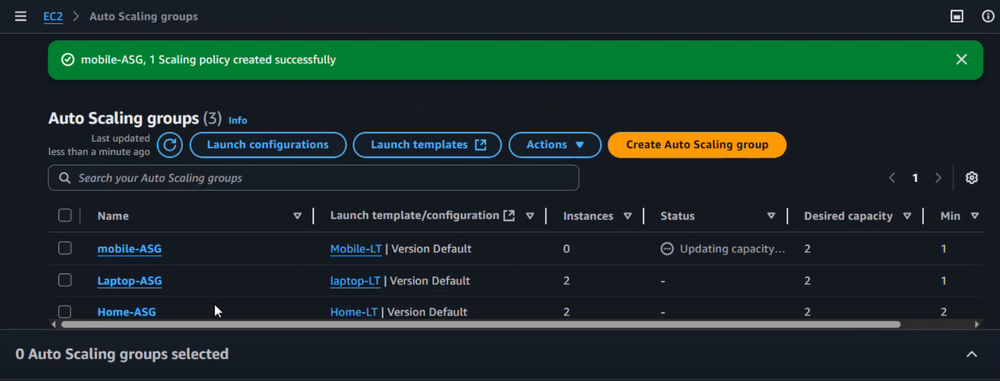

## Extended Webserver Using Auto Scaling Group

##### Overview: This project deploys application using AWS Auto Scaling Group,Elastic Load Balancer,Target Groups.The architecture ensures high availability,fault tolerance and dyanamic scalability based on demand.

* ### Architecture Overview:
1) ###### Launch templates.
2) ###### Auto scaling group.
3) ###### Load balancer.
4) ###### Target groups.

### Auto-Scaling Group:
###### An auto scaling group is a resource in AWS that automatically adjusts the number of compute instances in response to demand.ASG automatically increases/decreases the number of running servers based on policies,schedules and real time metrics.It helps to maintain application performance and availability.

### Key Concepts:
###### * Desired capacity:ASG tries to maintain this number unless scaling policies dictate otherwise.

###### * Min/Max Size: We have to define min/max number of instances the group can scale to according to CPU-utilization.

###### * Health Checks and replacements:ASG can perform health checks on instances and replace unhealthy ones automatically.

###### * Load Balancer:ASG works with load balancer to redirect traffic to healthy server.

Following is the raw architecture of project.

### Prerequisites:
1) ###### AWS account(free-tier)
2) ###### EC2 service

#### Note:Here in this project we will deploy an extended webserver application(home,mobile,laptop) with different scaling policies as shown in architecture.

### Deployment Steps:

* ###### Step1-Create launch template where we have to select AMI as Amazon Linux,select security group and key pair(if not created first create key pair and security group).
#### Security group :
######                 Port-80 Protocol-HTTP
######                 Port-443 Protocol-HTTPS
######                 Port-22 Protocol-SSH

###### After that max out advanced details section and pass the user data script as below.

###### * This is home page script
###### Click on create launch template.
###### Repeat the same process to create launch template for laptop and mobile page by passing following user-data script.

###### * This is laptop page script.

###### * This is mobile page script.

###### After this process we should have three templates launched i.e "home,laptop,mobile"

* ###### Step2-After launching templates we have to create auto-scaling group named home-asg,laptop-asg,mobile-asg where we have to select specified template for specified asg.For ex-select home template for home-asg,laptop template for laptop-asg and so on.

###### Following img shows steps to create auto-scaling group.

###### In second step we have to select three AZ's to launch server if one of launched is down due to heavy traffic.
###### Select balanced best effort which means if one server is down asg will automatically launch new server in healthy AZ.
###### In fourth step we have define group size(min,desired,max)depending on scaling policy.If it is static then select no scaling policy option and values should be(min-2,max-2,desired-2).

###### If the policy is dynamic or scheduled then the values should be different.For ex.(min-1,desired-2,max-4).Desired sixe should always be in between min and max size.

###### For dynamic and scheduled policy choose target tracking scaling policy.
###### Repeat same process for laptop-asg and mobile-asg.
###### After the creating ASG we should have three ASG(home-asg,laptop-asg,mobile-asg)

###### As shown in raw architecture mobile page is having scheduled policy. Scheduled policy refers to a policy that triggers certain actions at specific time or on a recurring schedule.For ex."Flipcart"has BigBillionDays Sale scheduled in september for every year.
###### So for schedules policy select mobile-asg and select automatic scaling from various sectors.In automatic scaling just click on create schedule with scaling size and recurrence.

###### For specified recurrence choose cron jobs i.e you can specifically create scheduled for specific date time month weekday.For ex(30 4 23 3 *)
###### 30-mins 
###### 4-hour
###### 23-date
###### 3-month(march)
###### *-weekday(use * as we dont know which weekday falls)

* ###### Step3-Creating target groups(home-TG,laptop-TG,mobile-TG)

* ###### Note-For laptop and mobile page we have to mention health check path so  that if we select laptop option, target group should redirect to laptop page only.

###### After creating target groups we have to associate those target groups with particular ASG's i.e Home-TG to Home-ASG likewise.Select TG click on actions-edit-attach TG.
* ###### Note-We attach target group to asg primarily to enable automatic registration of instances wiht load balancer.Target group act as a link between load balancer and asg.

* ###### Step4-Create application load balancer.Load balancer controls incoming traffic and does health checks whether the instance is healthy or not.
###### i) select three az's.
###### ii) select security group.
###### iii) then in default action select target groups which you want as default which means if id address is runned then it should go to home page only(in this case I used home as default).
###### iv) create load balancer.

###### DNS is the ip address/name which we have to run on search engine to see our final deplyoment of application.

* ###### Step5-Last and final configuration is that we have to add listener rule in application load balancer.Go to ALB-listening rule-select HTTP:80-manage rule-add rule-add condition-select path-mention path for laptop and mobile as shown below.

* ###### Note-We have to mention path i.e listener rule so that if clicked on mobile then it should redirect to mobile section only.

###### At last there should be three rules.Default for home,rule1 for mobile,rule2 for laptop.

###### Finally we have to copy just DNS of Application Load Balancer and paste in search engines as convenience and see the outputs i.e our Extended Webserver using Auto-Scaling Group has been deployed.

* ### Deployed!